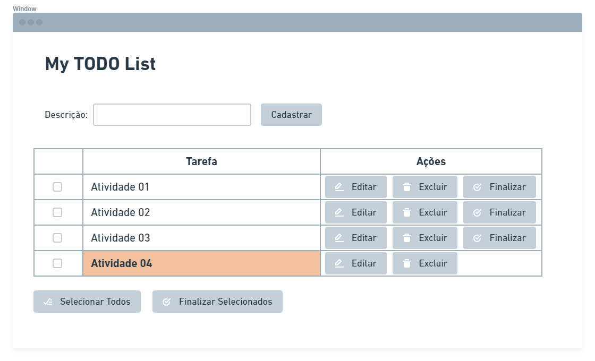

# Teste de Desenvolvimento - Frontend e Backend

Olá! Bom dia, boa tarde ou boa noite!

Este é um desafio criado para a nossa seleção de uma pessoa Engenheira de Software que irá atuar na role de DEV.

Leia atentamente todo o conteúdo desse documento antes de começar qualquer execução!

## Instruções gerais

O desafio consiste em implementar um app de TODO List simples que possua um frontend e um backend para processar e armazenar as operações e dados.

Não definiremos linguagens ou frameworks a serem utilizados, no entanto, o uso de frameworks como Angular, Vue.js e React além de linguagens como Java e C# podem ser um diferencial para avaliar o conhecimento nessas stacks. Fica a seu critério escolher o que se adequa mais ao seu perfil e/ou ao seu conhecimento.

A entrega desse teste deve ser feita através do seu repositório Git pessoal (GitHub, Bitbucket, etc).

Qualquer dúvida que tenha, basta entrar em contato conosco que teremos o maior prazer em te ajudar!

### Critérios para avaliação
- Organização de código, arquitetura e boas práticas de programação (SOLID, Clean Code, etc)
- Como foi a utilização dos framework e bibliotecas utilizados e da linguagem de programação
- Comunicação entre as aplicações (frontend e backend) deverá ocorrer através do protocolo HTTP com chamadas Rest utilizando o formato JSON
- Documentação de como executar os projetos no ambiente local
- Implementação de testes de unidade (diferencial)
- Aplicações executando em containers Docker / docker-compose (diferencial)

# Construindo um app de todo-list

## Meu Todo List App

### Frontend

- Faça o setup de um novo projeto
- Criar uma página com formulário para inclusão da lista de TODOs. A página deverá conter:
  - Campo de input para inserir a descrição
  - Botão para cadastrar
- Na mesma página, criar uma tabela para visualizar os itens já cadastrados. A tabela deverá permitir realizar as seguintes ações para cada item:
  - Botão para editar o texto
  - Botão para excluir o item
  - Botão para marcar o item como finalizado
- Os itens finalizados deverão ser apresentados em uma cor diferente dos demais itens na lista
- Criar uma opção para selecionar os itens da lista e um botão para finalizar todos com uma única ação

### Backend

- Faça o setup de um novo projeto
- Criar APIs Rest para as seguintes operações:
  - Salvar / atualizar um item
    - Poderá ser utilizado também para mudar o status do item para finalizado
  - Excluir um item
  

**Obs.:** A persistência das informações pode ser em memória ou em um banco de dados, fica a seu critério conforme se sentir mais confortável em atuar.

## Considerações finais

Aqui, finalizamos o teste! Espero que tenha conseguido fazer tudo com bastante carinho e atenção! Aguardamos pelo seu envio e, assim que fizermos a avaliação, iremos te dar um retorno com feedbacks a respeito.

Esperamos também que tenha gostado e que tenha aprendido um pouco conosco!

Até breve!
